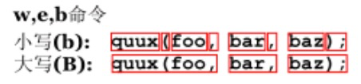
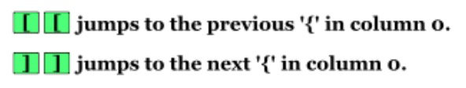
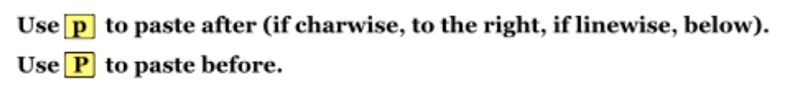
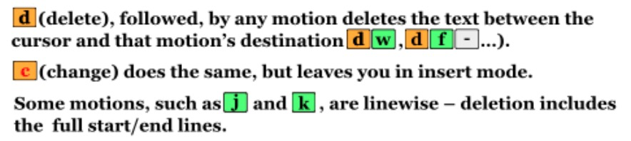
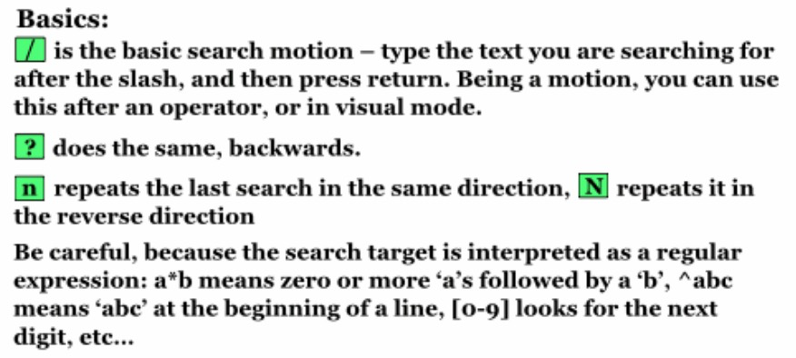

# Vim Notes

2020.05.06 By XKB


## 名称符号约定

Insert - mode：插入模式、编辑模式

Normal - mode：常规模式、正常模式，大部分命令的适用场景

Ctrl + △：同时按 Control + △ 

f△ ：f 后面加一个字母参数键△

□f：□ 是一个数字键

```txt
"    int i = 0;    "
```

第一个空格处是软行首，第一个 i 处是硬行首；

最后一个空格处是软行尾，最后一个分号处是硬行尾。


# 正常模式

## 模式转换

### 进入正常模式

|       按键        |     功能     |      备注       |
| :---------------: | :----------: | :-------------: |
| Esc, Ctrl + [, jk | 进入常规模式 | 编辑线➡️方框右边 |

### 进入插入模式


|    按键    |          功能          |             备注             |
| :--------: | :--------------------: | :--------------------------: |
|     i      |   在当前字符前面插入   |       方框左边➡️编辑符        |
| I（大写i） |   在当前行最前面插入   | 在语句的最左，不是整行的最左 |
|     a      |   在当前字符后面插入   |       方框右边➡️编辑符        |
|     A      |   在当前行最后面插入   |     在整行能到达的最右端     |
|     o      | 在本行下方新建空行插入 |                              |
|     O      | 在本行上方新建空行插入 |                              |

### 删除后插入

|    按键     |                    功能                    |         备注         |
| :---------: | :----------------------------------------: | :------------------: |
|      s      |               删除字符并插入               |                      |
|     caw     |           删除光标所在单词并插入           |     删除尾随空格     |
|     caW     |           删除光标所在词群并插入           |     删除尾随空格     |
|     ciw     |           删除光标所在单词并插入           |    不删除两边空格    |
|     ciW     |           删除光标所在词群并插入           |    不删除两边空格    |
|    S, cc    |              删除一整行并插入              | 进入插入模式，行还在 |
|     □cc     |               删除□行并插入                | 进入插入模式，行还在 |
| c + 删除键  |         删除当前光标左边字符并插入         |                      |
|    C, c$    |            删除光标到行尾并插入            | 光标所在位字符也删除 |
|     c0      |            删除光标到行首并插入            | 光标所在位字符不删除 |
|     ch      |        删除光标所在处左边字符并插入        |                      |
|     cj      |       删除本行和下一行，留一行并插入       |    编辑符留在新行    |
|     ck      |       删除本行和上一行，留一行并插入       |    编辑符留在新行    |
| cl（L小写） |          删除光标所在处字符并插入          |                      |
|     cw      | 删除光标到单词尾（后一个空格也删除）并插入 | 光标所在位字符也删除 |


## 行操作

|      按键      |              功能              |     备注     |
| :------------: | :----------------------------: | :----------: |
|  command + j   |         把本行往上移动         |  总行数不变  |
|  command + k   |         把本行往下移动         |  总行数不变  |
|       J        |      下一行合并到本行末尾      |              |
|       <<       |            本行缩进            |              |
|       >>       |            本行 Tab            |              |
|       ==       |          本行自动对齐          |              |
|   < + motion   |       motion 涉及行缩进        |    < 向左    |
|   > + motion   |  motion 涉及行 Tab（反缩进）   |    > 向右    |
|   = + motion   |     motion 涉及行自动对齐      |              |
|  Shift + 回车  |    不编辑本行地新建下一空行    | 留在正常模式 |
| Command + 回车 | 把本行光标及以后内容移到下一行 | 留在正常模式 |


## 移动光标

### 基本操作

|    按键     |       功能       |    备注    |
| :---------: | :--------------: | :--------: |
|   h j k l   | ← ↓ ↑ → 移动光标 |            |
| □ + h j k l |   移动□个单位    |            |
|    回车     |   移动到下一行   | 下一行行首 |

### 行内移动

```txt
____XXX____
|   软    |
   |硬|
```

| 按键 |      功能      |          备注          |
| :--: | :------------: | :--------------------: |
|  \|  | 移动到本行行首 |         软行首         |
|  0   | 移动到本行行首 | 硬行首（不看首尾空格） |
|  ^   | 移动到本行行首 | 硬行首（不看首尾空格） |
|  $   | 移动到本行行尾 |         软行尾         |
|  g_  | 移动到本行行尾 | 硬行尾（不看首尾空格） |


### 词间移动

| 按键 |        功能        |          备注          |
| :--: | :----------------: | :--------------------: |
|  e   | 移动到下一个单词尾 | 连续标点算一个单独单词 |
|  w   | 移动到下一个单词首 | 连续标点算一个单独单词 |
|  b   | 移动到上一个单词首 | 连续标点算一个单独单词 |
|  E   | 移动到下一个词群尾 |   没空格隔开就是词群   |
|  W   | 移动到下一个词群首 |   没空格隔开就是词群   |
|  B   | 移动到上一个词群首 |   没空格隔开就是词群   |



### 跨行移动

|   按键   |              功能              |      备注       |
| :------: | :----------------------------: | :-------------: |
|    □G    |         到第□行的行首          |     硬行首      |
|    gg    |         到第一行的行首         |                 |
|    G     |        到最后一行的行首        |                 |
|    H     |         到屏幕顶行行首         | ❎ IDEA 上有差错 |
|    L     |         到屏幕底行行首         | ❎ IDEA 上有差错 |
|    M     |        到屏幕中间行行首        |                 |
| Ctrl + u |           向上半翻页           |                 |
| Ctrl + d |           向下半翻页           |                 |
| Ctrl + b |           翻到上一页           |  ❎ IDEA 上无效  |
| Ctrl + f |           翻到下一页           |                 |
|    %     | 到最近的括号或当前括号的另一半 |    ( , { , [    |
|    -     |          到上一行行首          |     硬行首      |
|    +     |          到下一行行首          |     硬行首      |
|  ( 和 )  |  跳转到当前语句的开头 / 结尾   |                 |
|  { 和 }  |      跳转到上/下一批空行       |                 |



## 复制、粘贴、删除

### 复制

| 按键  |    功能    | 备注 |
| :---: | :--------: | :--: |
| yy, Y | 复制当前行 |      |

`y` 是复制（yank）的意思，通常搭配一个字符（复制范围）实现复制的功能，常用的如下：

` yw` 复制一个单词，还有 `ynw` 

` yfa` 复制光标到下一个 a 的字符处,还有`ynfa` 

` yy` 复制一行，还有 `nyy` 

`y$` 复制光标到本号的结尾

`yH` 复制屏幕显示的第一行文本到光标所在的行

`yG` 复制光标所在行到文本的结束

### 粘贴

| 按键 | 功能 |                             备注                             |
| :--: | :--: | :----------------------------------------------------------: |
|  p   | 粘贴 | 如果成字符复制，粘贴在光标右边处；如果成行复制，粘贴在下一行 |
|  P   | 粘贴 | 如果成字符复制，粘贴在光标右边处；如果成行复制，粘贴在上一行 |



### 删除

#### 不含 d：

| 按键  |       功能       |                  备注                  |
| :---: | :--------------: | :------------------------------------: |
|   x   |   删除当前字符   |              方框位置不变              |
|   X   |   删除左边字符   |              方框跟随字符              |
|   s   |  删除字符并插入  |              进入插入模式              |
| S, cc | 删除一整行并插入 | 进入插入模式，行还在，光标留在原硬行首 |

#### 含 d：

|    按键     |                        功能                        |         备注         |
| :---------: | :------------------------------------------------: | :------------------: |
|     daw     |                  删除光标所在单词                  |     删除尾随空格     |
|     daW     |                  删除光标所在词群                  |     删除尾随空格     |
|     diw     |                  删除光标所在单词                  |    不删除两边空格    |
|     db      |                删除光标左边到单词首                |  不包括光标所在字符  |
|     dd      |                     删除一整行                     | 留在正常模式，行不在 |
|     □dd     |                      删除□行                       | 留在正常模式，行不在 |
|   :1,10d    |                     删除1-10行                     |                      |
| d + 删除键  |                删除当前光标左边字符                |                      |
|    D, d$    |                   删除光标到行尾                   | 光标所在位字符也删除 |
|     d0      |                   删除光标到行首                   | 光标所在位字符不删除 |
|     dh      |               删除光标所在处左边字符               |                      |
|     dj      |                  删除本行和下一行                  |  光标留在下下行行首  |
|     dk      |                  删除本行和上一行                  |   光标留在下行行首   |
| dl（L小写） |                 删除光标所在处字符                 |                      |
|     dw      |        删除光标到单词尾（后一个空格也删除）        | 光标所在位字符也删除 |
|     d□w     |      删除光标开始□个单词（后一个空格也删除）       | 光标所在位字符也删除 |
|     df△     | 删除光标处到下一个为△的字符处（ f△定位光标到△处 ） |       左闭右闭       |
|    d□f△     |            删除光标处到第□个为△的字符处            |       左闭右闭       |
|     dH      |       删除屏幕显示的第一行文本到光标所在的行       |   ❎ 试了下，不对劲   |
|     dG      |             删除光标所在行到文本的结束             |                      |

将以上的`d`换为`c`，则删除后进入插入模式。




## 替换、大小写转换

### 替换

| 按键 |              功能              |               备注                |
| :--: | :----------------------------: | :-------------------------------: |
|  r   |    替换掉光标当前所在的字符    |                                   |
|  R   | 替换掉从光标开始以后的所有字符 | 除非用`<ESC>`及其替代退出编辑模式 |


### 大小写转换

| 按键 | 功能 | 备注 |
| :--: | :--: | :--: |
|      |      |      |

`~` 将光标下的字母改变大小写

`3~`将光标位置开始的3个字母改变其大小写

`g~~` 改变当前行字母的大小写

`gUU` 将当前行的字母改成大写

`guu` 将当前行的字母全改成小写

`3gUU` 将从光标开始到下面3行字母改成大写

`gUw` 将光标下的单词改成大写。

`guw` 将光标下的单词改成小写


## 查找

### 行内查找

| 按键 |                   功能                   |                        备注                         |
| :--: | :--------------------------------------: | :-------------------------------------------------: |
|  f△  |     移动光标到本行下一个为△的字符处      | 不考虑当前字符，区分大小写。‘;’ 下一个，','上一个。 |
|  F△  |          同上，光标移动方向向左          |                                                     |
| □f△  |   移动到本行光标处开始第□个为△的字符处   |             不考虑当前字符，区分大小写              |
| □F△  |          同上，光标移动方向向左          |                                                     |
|  t△  |   移动光标到本行下一个为△的字符的左边    |            不考虑当前字符，可能留在原位             |
|  T△  |          同上，光标移动方向向左          |                                                     |
| □t△  | 移动到本行光标处开始第□个为△的字符的左边 |            不考虑当前字符，可能留在原位             |
| □T△  |          同上，光标移动方向向左          |                                                     |

### 全局查找

|   按键   |        功能        |           备注            |
| :------: | :----------------: | :-----------------------: |
|    /△    |     向后搜索△      | 回车结束输入，/` 回车退出 |
|    ?△    |     向前搜索△      | 回车结束输入，/` 回车退出 |
|    *     |     查找下一处     |     不受 /? 方向影响      |
|    #     |     查找上一处     |     不受 /? 方向影响      |
|    n     |   查找同向下一处   | 被 *# 影响后往它们的同向  |
|    N     |   查找同向上一处   | 被 *# 影响后往它们的反向  |
| 单独的 * | 查找下一个匹配单词 |                           |
| 单独的 # | 查找上一个匹配单词 |                           |

`*` 和 `#` 匹配光标当前所在的单词，移动光标到下一个（或者上一个）匹配的单词（ `*` 是下一个，`#` 是上一个）




## 动作操作

### 撤销、恢复操作

|   按键   |         功能          |                备注                |
| :------: | :-------------------: | :--------------------------------: |
|    u     | 撤销上个命令（Undo）  | 可连续撤销（移位也属于可撤销操作） |
| Ctrl + r | 撤销 撤销命令（Redo） |             可连续恢复             |

### 重复命令

|    按键    |          功能          |      备注      |
| :--------: | :--------------------: | :------------: |
|     .      |     重复上一个命令     | 不包括光标移动 |
| □<Command> | 重复<Command>操作□次， |  包括光标移动  |

# 命令模式

|    按键     |    功能    | 备注 |
| :---------: | :--------: | :--: |
| :w + Enter  |    保存    |      |
| :q + Enter  |    退出    |      |
| :q! + Enter | 不保存退出 |      |

# 可视模式

|   按键   |    功能    | 备注 |
| :------: | :--------: | :--: |
|    v     | 字符可视化 |      |
|    V     |  行可视化  |      |
| Ctrl + v | 方块可视化 |      |


